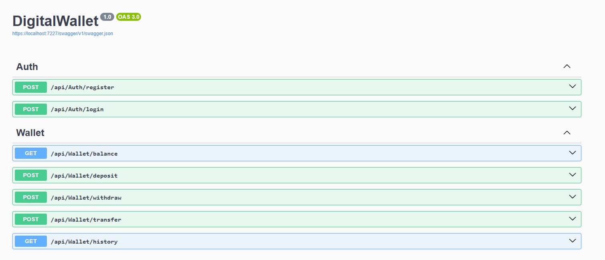
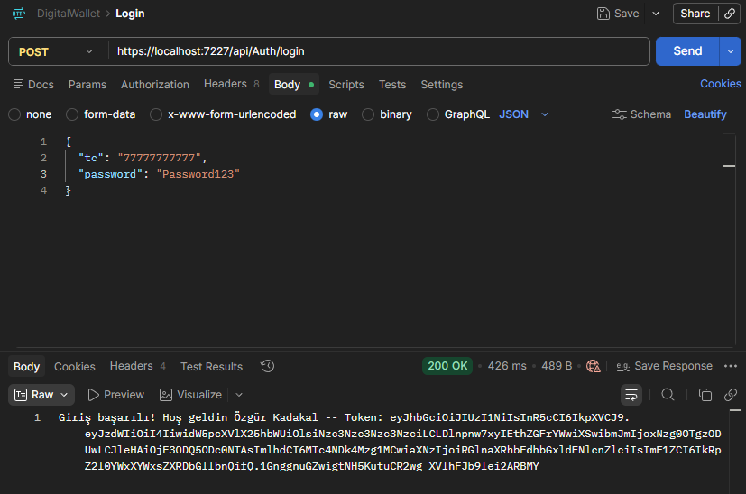
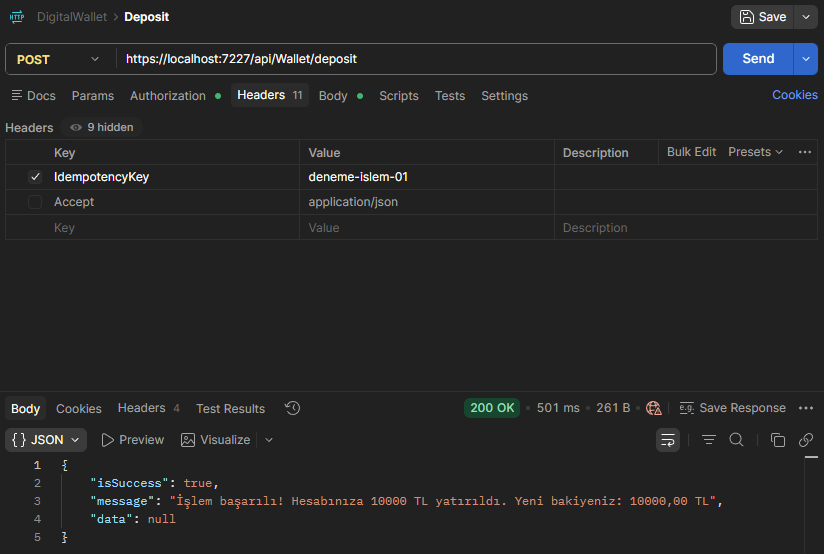
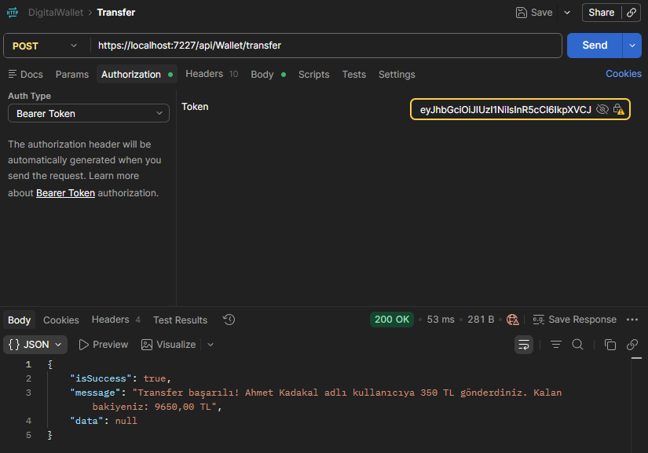
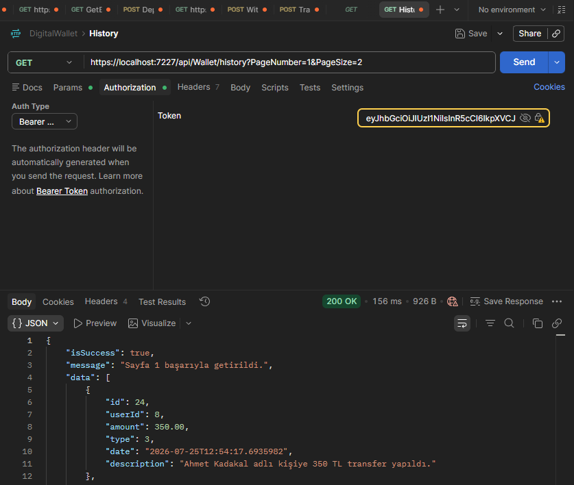

# 💳 DigitalWallet - Secure Digital Wallet API 🛡️

### Developed by Özgür Kadakal

> **⚠️ Important:** This project uses **SQL Server (LocalDB)** and requires a **JWT Secret Key** before running.

---

# 🖼️ Previews & API Testing

## 🟢 API Overview (Swagger UI)



---

## 🔐 Authentication & JWT Generation (Postman)

> Secure login system that generates a valid JSON Web Token (JWT) for authorized requests.



---

## 💰 Secure Deposit & Idempotency (Postman)

> Users can securely deposit money. The Idempotency mechanism prevents duplicate financial transactions caused by network failures or repeated requests.



---

## 💸 Fund Transfer & KVKK Compliance (Postman)

> Secure peer-to-peer transfers using Turkish Identity Numbers (TC). Sensitive information is masked in logs to comply with KVKK privacy principles.



---

## 📜 Paginated Transaction History (Postman)

> Optimized transaction history with server-side pagination using **PageNumber** and **PageSize**.



---

# 💳 DigitalWallet API

DigitalWallet is a secure backend project developed with **ASP.NET Core Web API**.

The project focuses on:

- Financial security
- Wallet management
- JWT authentication
- Idempotent financial operations
- Rate limiting
- Structured logging
- KVKK-compliant sensitive data masking
- Clean layered architecture

---

# ✨ Features

## 🔐 Authentication & Security

- 🛡️ JWT Authentication
  - Secure token-based authentication.

- 🔑 Password Hashing
  - Passwords are securely stored using BCrypt.

- 🔒 KVKK Data Protection
  - Sensitive data such as Turkish Identity Numbers are masked in logs.
  - Example:
    ```
    111*****112
    ```

---

## 💰 Wallet & Financial Operations

### 💵 Balance Inquiry

- View the current wallet balance instantly.

### 📥 Deposit

- Securely deposit money into the wallet.

### 📤 Withdraw

- Withdraw money with balance validation.

### 💸 Transfer

- Send money to another user using their Turkish Identity Number.

### 🔄 Idempotency Support

- Prevents duplicate deposits and transfers during unstable network conditions or repeated requests.

### 📜 Transaction History

- Paginated transaction history.

- Supports:
  - PageNumber
  - PageSize

---

## 🛡️ Protection & Observability

### ⚡ Rate Limiting

Sliding Window Rate Limiter protects endpoints against:

- Brute Force attacks
- DDoS attempts
- Excessive requests

Returns

```
429 Too Many Requests
```

when limits are exceeded.

### 📝 Structured Logging

Serilog records important operations into rolling log files.

Examples include:

- Login attempts
- Transfers
- Deposits
- Withdrawals
- Security warnings

---

## ⚙️ Backend Architecture

- 🧩 Layered Architecture

```
Controller
     ↓
 Service
     ↓
 Repository
     ↓
 Database
```

- 🔄 Dependency Injection

- 🗄️ Entity Framework Core

- 🌐 Global Exception Handling

- ⚡ Async Programming

---

# ⚙️ Setup

## 1️⃣ Clone the Repository

```bash
git clone https://github.com/kadakalozgur/DigitalWallet.git
```

```bash
cd DigitalWallet
```

---

## 2️⃣ Create the Database

Open

```
Tools
→ NuGet Package Manager
→ Package Manager Console
```

Run

```powershell
Update-Database
```

> ⚠️ Skipping this step will cause the application to fail during startup.

---

## 3️⃣ Configure JWT Secret Key

### Option 1 — appsettings.json

```json
"JwtSettings": {
  "Issuer": "DigitalWalletApp",
  "Audience": "DigitalWalletUsers",
  "Key": "your-super-secret-key-at-least-32-bytes"
}
```

### Option 2 — User Secrets (Recommended)

Initialize

```bash
dotnet user-secrets init
```

Then set the key

```bash
dotnet user-secrets set "JwtSettings:Key" "your-super-secret-key-at-least-32-bytes"
```

---

# 🛠 Tech Stack

| Category | Technology |
|----------|------------|
| Language | C# |
| Framework | ASP.NET Core Web API |
| Database | SQL Server (LocalDB) |
| ORM | Entity Framework Core |
| Authentication | JWT (JSON Web Token) |
| Security | IdempotencyAPI, ASP.NET Core Rate Limiting |
| Logging | Serilog |
| IDE | Visual Studio 2022 |

---

# 📚 Additional Notes

- This project was developed to practice **advanced backend engineering** and **financial application architecture**.
- AI-assisted tools were used during the development process.
- The project was developed from scratch by **Özgür Kadakal**.

---

# 📬 Contact

For feedback, questions or suggestions:

📧 **ozgurkreach@gmail.com**

---

---

# 🇹🇷 Türkçe

# 💳 DigitalWallet - Güvenli Dijital Cüzdan API 🛡️

### Geliştirici: Özgür Kadakal

> **⚠️ Önemli:** Bu proje **SQL Server (LocalDB)** kullanır ve çalıştırmadan önce **JWT Secret Key** tanımlanmalıdır.

---

# 🖼️ Önizlemeler & API Testleri

## 🟢 API Genel Bakış (Swagger UI)


---

## 🔐 Kimlik Doğrulama & JWT Üretimi (Postman)

> Yetkili istekler için geçerli bir JSON Web Token (JWT) üreten güvenli giriş sistemi.


---

## 💰 Güvenli Para Yatırma & Idempotency (Postman)

> Kullanıcılar güvenli şekilde para yatırabilir. Idempotency mekanizması, ağ hataları veya tekrar eden istekler nedeniyle oluşabilecek mükerrer finansal işlemleri engeller.


---

## 💸 Para Transferi & KVKK Uyumu (Postman)

> TC Kimlik Numarası ile güvenli para transferi yapılır. Hassas veriler loglarda maskelenerek KVKK ilkelerine uygun şekilde korunur.


---

## 📜 Sayfalanmış İşlem Geçmişi (Postman)

> PageNumber ve PageSize parametreleri kullanılarak sunucu tarafında optimize edilmiş sayfalama desteği.


---

# 💳 DigitalWallet API

DigitalWallet, **ASP.NET Core Web API** kullanılarak geliştirilmiş güvenli bir backend projesidir.

Odak noktaları:

- Finansal güvenlik
- Cüzdan yönetimi
- JWT kimlik doğrulama
- Idempotent finansal işlemler
- Rate Limiting
- Yapısal loglama
- KVKK uyumlu veri maskeleme
- Katmanlı mimari

---

# ✨ Özellikler

## 🔐 Kimlik Doğrulama ve Güvenlik

- 🛡️ JWT Authentication
  - Token tabanlı güvenli kimlik doğrulama.

- 🔑 BCrypt
  - Şifreler BCrypt algoritması ile hashlenerek saklanır.

- 🔒 KVKK Veri Koruması
  - TC Kimlik Numaraları gibi hassas bilgiler loglarda maskelenir.

Örnek:

```
111*****112
```

---

## 💰 Cüzdan İşlemleri

### 💵 Bakiye Sorgulama

- Güncel cüzdan bakiyesi görüntülenebilir.

### 📥 Para Yatırma

- Güvenli şekilde bakiye yükleme.

### 📤 Para Çekme

- Bakiye kontrolü yapılarak para çekilebilir.

### 💸 Para Transferi

- TC Kimlik Numarası ile kullanıcılar arasında para transferi.

### 🔄 Idempotency

- Aynı isteğin tekrar gönderilmesi durumunda mükerrer para transferlerini önler.

### 📜 İşlem Geçmişi

- Sayfalama destekli işlem geçmişi.

Desteklenen parametreler:

- PageNumber
- PageSize

---

## 🛡️ Sistem Koruması

### ⚡ Rate Limiting

Sliding Window algoritması sayesinde API aşağıdakilere karşı korunur:

- Brute Force saldırıları
- DDoS girişimleri
- Çok sık yapılan istekler

Limit aşılırsa

```
429 Too Many Requests
```

cevabı döndürülür.

### 📝 Yapısal Loglama

Serilog ile aşağıdaki işlemler günlük dosyalarına kaydedilir:

- Giriş denemeleri
- Para transferleri
- Para yatırma
- Para çekme
- Güvenlik uyarıları

---

## ⚙️ Backend Mimarisi

```
Controller
     ↓
 Service
     ↓
 Repository
     ↓
 Database
```

- Dependency Injection
- Entity Framework Core
- Global Exception Handling
- Async Programming

---

# ⚙️ Kurulum

## 1️⃣ Projeyi Klonlayın

```bash
git clone https://github.com/kadakalozgur/DigitalWallet.git
```

```bash
cd DigitalWallet
```

---

## 2️⃣ Veritabanını Oluşturun

Visual Studio içerisinde

```
Tools
→ NuGet Package Manager
→ Package Manager Console
```

açın ve çalıştırın:

```powershell
Update-Database
```

> ⚠️ Bu adımı atlamanız durumunda uygulama başlangıçta hata verecektir.

---

## 3️⃣ JWT Secret Key Ayarlayın

### Seçenek 1 — appsettings.json

```json
"JwtSettings": {
  "Issuer": "DigitalWalletApp",
  "Audience": "DigitalWalletUsers",
  "Key": "gizli-ve-en-az-32-byte-anahtariniz"
}
```

### Seçenek 2 — User Secrets (Önerilir)

```bash
dotnet user-secrets init
```

```bash
dotnet user-secrets set "JwtSettings:Key" "gizli-ve-en-az-32-byte-anahtariniz"
```

---

# 🛠 Kullanılan Teknolojiler

| Kategori | Teknoloji |
|----------|-----------|
| Dil | C# |
| Framework | ASP.NET Core Web API |
| Veritabanı | SQL Server (LocalDB) |
| ORM | Entity Framework Core |
| Kimlik Doğrulama | JWT |
| Güvenlik | IdempotencyAPI, ASP.NET Core Rate Limiting |
| Loglama | Serilog |
| IDE | Visual Studio 2022 |

---

# 📚 Ek Notlar

- Bu proje ileri seviye backend geliştirme pratiği amacıyla hazırlanmıştır.
- Geliştirme sürecinde yapay zekâ destekli araçlardan yararlanılmıştır.
- Proje tamamen Özgür Kadakal tarafından geliştirilmiştir.

---

# 📬 İletişim

Her türlü geri bildirim, öneri veya soru için:

📧 **ozgurkreach@gmail.com**
